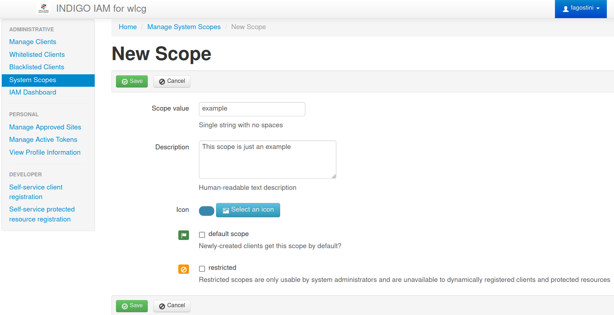

During the [client registration][client-registration], a user can assign any scope to the client, 
but IAM will grant only the list of scopes available among the MitreID **System Scopes**.

In order to include a new scope into the System Scopes, an IAM administrator has to add it manually
from the `System Scopes` tab on the left side of the MitreID dashboard:

* if the box `default scope` is checked, the scope will be assigned to any newly regirested client,
  even if it is not explicitly requested;
* if the box `restricted` is checked, the scope will not be available to dynamically registered clients
  and can only be assigned to clients by IAM administrators;
* if no one box is checked, any dynamically registered client has to explicitly request for this scope
  at the registration time, and it will be granted without intervention of IAM administrators.

[client-registration]: 

