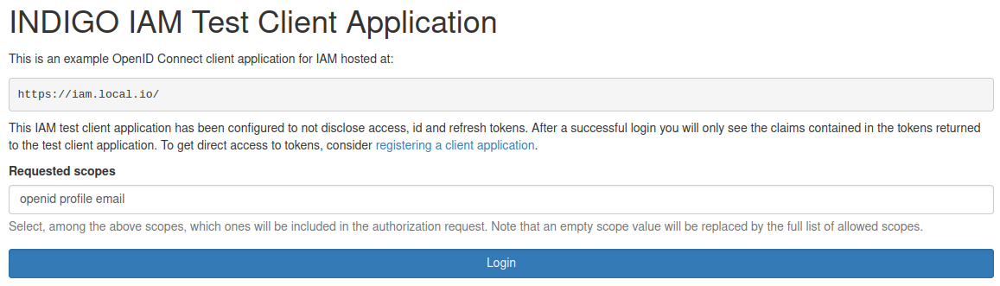

IAM Test Client is a simple web application that demonstrates the use of the OpenID Connect client code and configuration.

It lives at `https://your-IAM-instance/iam-test-client`.

Since Test Client uses OAuth Authorization Code Grant Type, after a successfull login you will be redirected to the consent page that the authorization server displays to confirm if the requested scopes can be shared with the client. 

If you authorize, the following information will be shown:

In order to run the Test Client application you need to setup a minimal [configuration]().
