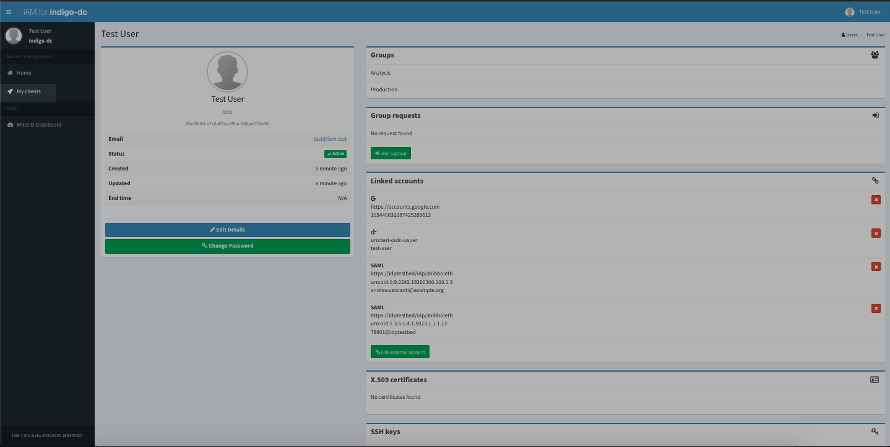
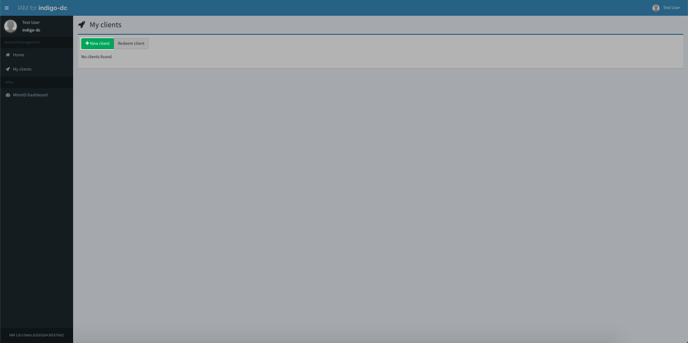
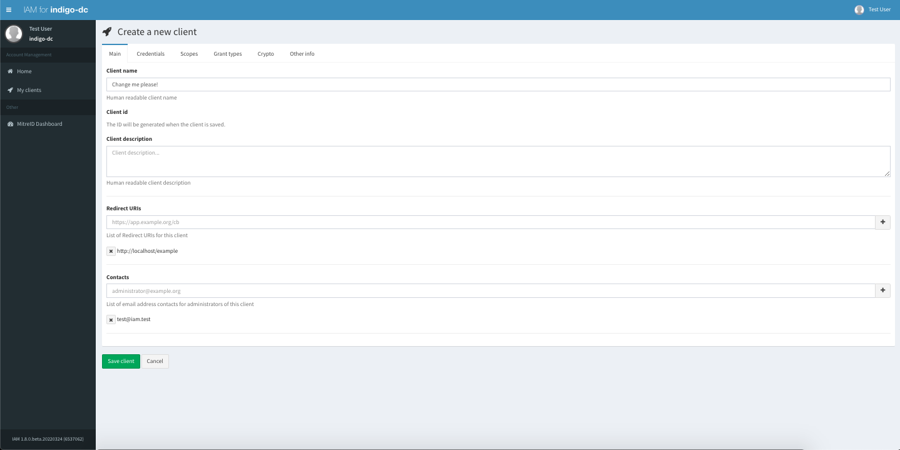
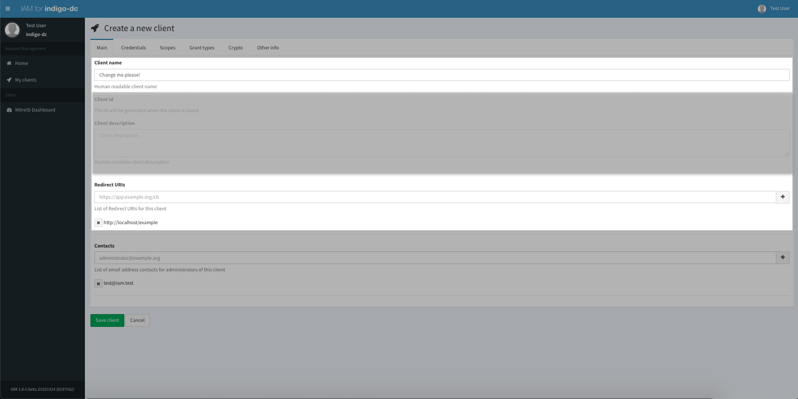
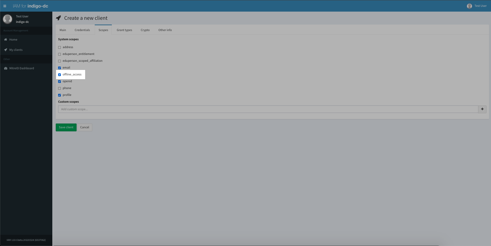
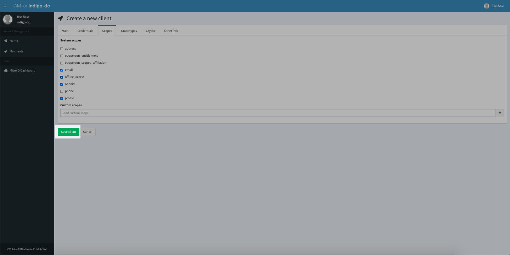
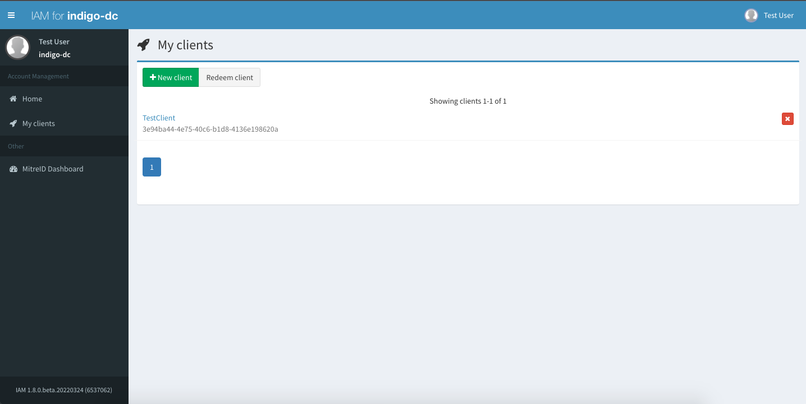

IAM exposes the OpenID Connect/OAuth dynamic client registration functionality
on its own dashboard (it has been migrated by [MitreID][mitreid] dashboard).

In OAuth terminology, a client is an application or service that can interact
with an authorization server for authentication/authorization purposes.

A new client can be registered in the IAM in two ways:

- using the [dynamic client registration API][reg-api];
- via the IAM dashboard (which simply acts as a client to the API mentioned
  above).

## Registering a client using the dashboard

Log into the service and click on the _My Clients_ link on the left
navigation bar:

From the _My client_ link, select _New client_:

A form will open that enable you to configure your client:

The minimum information you have to provide is:

- *Client name*: choose a name for your client
- *Redirect URI(s)*: one or more redirect URIs for your client; these are
  required if you choose to enable the authorization code flow;

Remember to select the `offline_access` scope from the __Scopes__ tab if you
want to request refresh tokens for the client being created:

You can then click the __Save__ button at the bottom of the page:

IAM will then generate client credentials for your client and other information
that will be displayed as follows:

[mitreid]: https://github.com/mitreid-connect/OpenID-Connect-Java-Spring-Server/wiki
[reg-api]: 
