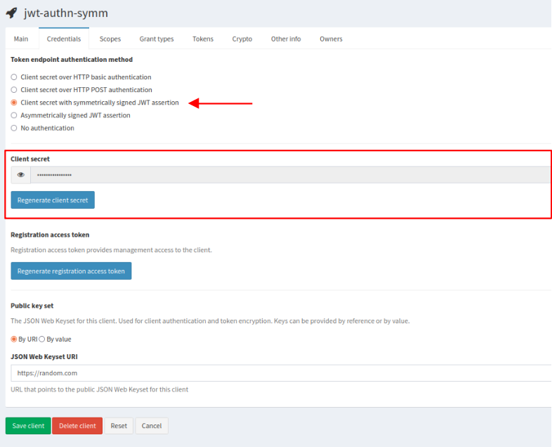
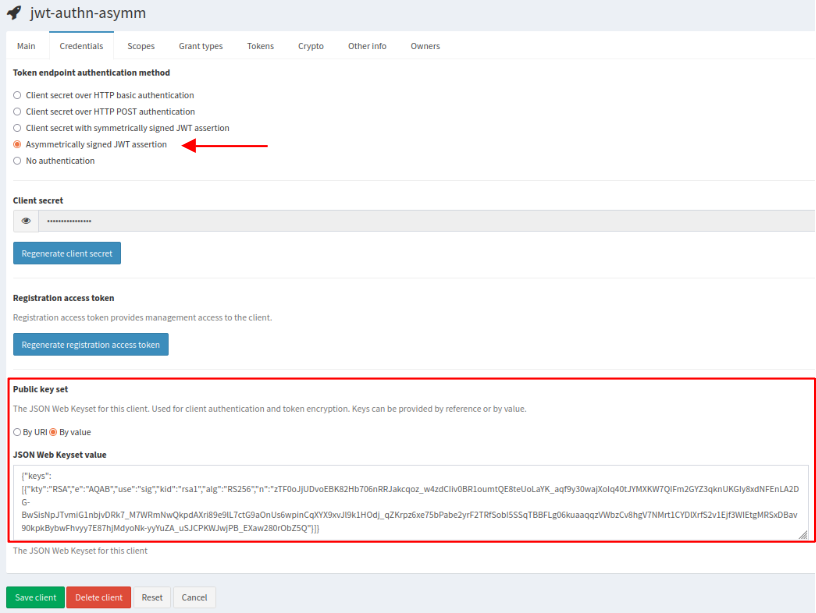

IAM supports several methods to authenticate an OAuth2 client to the token endpoint:

* client secret over HTTP basic authentication;
* client secret over HTTP POST authentication;
* client secret with symmetrically signed JWT assertion;
* asymmetrically signed JWT assertion;
* no authentication (for public clients).

The authentication via JWT assertion is defined in [RFC7523][jwt-authn].
This is useful when a client can issue a token for itself. It is used in combination
with several OAuth2 authorization grant, for instance the _authorization code_ flow (when a user has to approve the client in order to access to their resources), the _client credential_ flow (when a client is acting on its own behalf), etc.

## JWT assertion validation

The IAM Authorization Server validates the JWT assertion and issues an access token if
the following conditions are satisfied.

__JWT assertion header__

* the "alg" (algorithm) claim must be present to indicate the algorithm used to sign the token;
* the "kid" (key ID) claim must be present in the asymmetrically signed assertions to identify the public key.

__JWT assertion body__

* the "iss" (issuer) and "sub" (subject) claims must be equal to the `client_id`;
* the "aud" (audience) claim must be equal to the token endpoint URL;
* the "exp" (expiration) claim must be present to limit the JWT assertion lifetime;
* the "jti" (JWT ID) claim must be present and provides a unique identifier for the token.

## Client settings

[Register a new OAuth2 client in IAM][client-registration] which you use for issuing a JWT assertion and getting an access token.

Log into the service and click on the _My clients_ link on the left navigation bar to select your client.
From the _Credentials_ tab you can select the authentication method to the token endpoint.

### Symmetrically signed JWT assertion

It is used when your JWT assertion is signed with a symmetric key.

* Select _Client secret with symmetrically signed JWT assertion_;
* use the _Client secret_ generated by IAM as symmetric key to sign your JWT assertion.



A symmetrically signed JWT assertion looks like

```
## Header
{
  "alg": "HS256"
}
## Payload
{
  "sub": "181f26f9-4562-4919-b718-759241485335",
  "aud": "https://iam.local.io/token",
  "nbf": 1649162752,
  "iss": "181f26f9-4562-4919-b718-759241485335",
  "exp": 1651754752,
  "iat": 1649162752,
  "jti": "120240aa-e389-4a55-8384-f4d7a54c2633"
}
```

### Asymmetrically signed JWT assertion

It is used when your JWT assertion is signed with a private key.

* Select _Asymmetrically signed JWT assertion_;
* how do you want to expose the public key used by IAM to validate your JWT assertion?  
  Below _Public key set_, select
  * _By URI_, to provide a _JSON Web Keyset URI_ in the corresponding box, or
  * _By value_, to provide a _JSON Web Keyset value_ in the corresponding box.



An asymmetrically signed JWT assertion looks like

```
## Header
{
  "alg": "RS256",
  "kid": "rsa1"
}
## Payload
{
  "sub": "bdb6ca15-be9c-470a-81dc-69d30dabb340",
  "aud": "https://iam.local.io/token",
  "nbf": 1649162752,
  "iss": "bdb6ca15-be9c-470a-81dc-69d30dabb340",
  "exp": 1651754752,
  "iat": 1649162752,
  "jti": "f4392c1e-6d6a-423e-8e5e-5d114585f750"
}
```

## Getting an access token

Here is an example of an HTTP POST request to the token endpoint where the client is authenticated
with JWT assertion and is authorized via the client credential OAuth2 flow.  

```bash
$ curl -d client_assertion=${JWTA} -d client_assertion_type=urn:ietf:params:oauth:client-assertion-type:jwt-bearer -d grant_type=client_credentials https://iam.local.io/token | jq
{
  "access_token": "eyJraWQiOiJyc2ExIiwiY...",
  "token_type": "Bearer",
  "expires_in": 3599,
  "scope": "storage.read:/ storage.create:/ storage.modify:/"
}
```

If not explicitly requested in the payload, the scopes returned
in the access token are all the ones registered for your client.

[jwt-authn]: https://datatracker.ietf.org/doc/html/rfc7523#section-2.2
[client-registration]: ../client-registration
